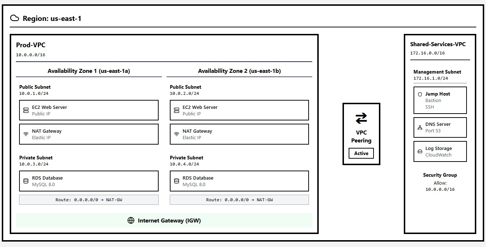

AWS Cloud Architecture Description
This architecture diagram illustrates a secure, resilient, and highly available Multi-VPC Infrastructure deployed within the Amazon Web Services (AWS) us-east-1 (N. Virginia) region. The design adheres to enterprise cloud practices by separating Production workloads from Shared Management Services using dedicated Virtual Private Clouds (VPCs).

1. Production VPC (Prod-VPC)
Network CIDR Block: 10.0.0.0/16

High Availability (HA): The network infrastructure is distributed across two distinct Availability Zones (us-east-1a and us-east-1b) to prevent a single point of failure (SPOF) and guarantee fault tolerance.

Network Segmentation (Subnet Layers):

Public Subnets (10.0.1.0/24 and 10.0.2.0/24): * Host the external-facing EC2 Web Servers, which are assigned Public IPs to listen to internet traffic.

Host the managed NAT Gateways assigned with static Elastic IPs. These gateways allow internal backend resources to securely connect out to the internet without exposing them to inbound threats.

Private Subnets (10.0.3.0/24 and 10.0.4.0/24):

Host the backend isolated RDS Database (MySQL 8.0) cluster.

Outbound traffic routing (0.0.0.0/0) is explicitly directed to the NAT-GW located within the respective public subnets. This configuration allows database instances to safely download operating system patches or software upgrades.

Edge Gateway: The entire Production VPC hooks into an Internet Gateway (IGW), enabling bidirectional traffic flow for the resources residing strictly inside the public subnets.

2. Shared Services VPC (Shared-Services-VPC)
Network CIDR Block: 172.16.0.0/16

Purpose: Acts as an isolated, centralized hub for operational management, logging, and core network utility services.

Management Subnet (172.16.1.0/24): 1. Jump Host (Bastion): A hardened EC2 instance listening over secure SSH. It acts as the singular, audited ingress point for network administrators to pivot into the environment.
2. DNS Server: Listens over Port 53 to manage internal domain name resolution across the private networks.
3. Log Storage (CloudWatch): A central repository for system logs, security audits, and infrastructure monitoring metric collection.

Stateful Firewall (Security Group): Implements a strict security stance by only allowing (Allow) incoming traffic originating explicitly from the Production network address block (10.0.0.0/16).

3. Inter-VPC Connectivity (VPC Peering)
Connection Status: Active

Mechanism: An active, non-transitive VPC Peering Connection acts as a private routing bridge between the Prod-VPC and Shared-Services-VPC.

Security Context: Traffic routed through this peering link flows entirely within the private AWS backbone global network infrastructure without traversing the public internet. This allows the administrative Jump Host to establish direct, secure SSH connections to the production servers while maintaining absolute isolation.
